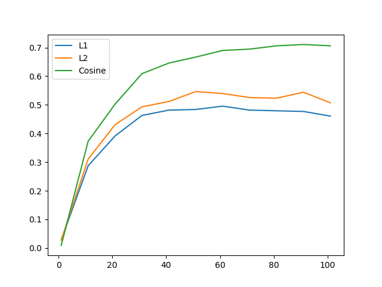
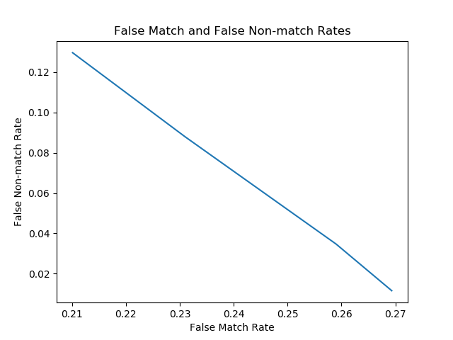

### IrisRecognition.py

The main function reads all the images and translate images into 2,044 feature vectors. It also generates plots for Iris recognition rate by different dimensions in LDA and false match rates against fasle non-match rates for different thresholds.

### IrisLocalization.py

#### pupil_detection
Based on data, the pixels values lower than 75 represents the pupil area. For some cases, it does include some parts from eyelashes. Parts of eyelashes exists as noise in the binarized image. Therefore, we can easily remove the noise by running the follow code.
```{python}
kernel = np.ones((15,15), np.uint8)
    im_bw = cv2.morphologyEx(im_bw, cv2.MORPH_CLOSE, kernel)
```
Then we have only the pupil. We can precisely calculate the origin and the radius of the pupil.
```{python}
length = np.array(range(len(im_bw)))
width = np.array(range(len(im_bw[0])))
col = int(round(np.mean(width[np.mean(im_bw, axis=0) != 255])))
row = int(round(np.mean(length[np.mean(im_bw, axis=1) != 255])))

r1 = sum(im_bw[row, :] == 0)
r2 = sum(im_bw[:, col] == 0)
r = int(round((r1+r2)/4))
```
I get the center of the pupil by getting pixel coordinates the pupil area and computing the mean. The radius is the average of the vertical length and the horizontal length from the center.

#### outer boundary
It resizes the image by 30% in order to speed up the computation. After downsing the image, it removes the pupil area in order to remove noise by eyelashes and the pupil edge.
```{python}
n, m = edges.shape
r1 = r + 12
y1, x1 = np.ogrid[-row:n-row, -col:m-col]
mask = x1*x1 + y1*y1 <= r1*r1
edges[mask] = 0
```
Then it subsequently removes unnecessary edges detected outside of the eye area. After removing noise, it fits a circle to detect the outer boundary of pupil. If no circles are found, we manually fit a circle centered at the pupil circle with the average radius of outer bounds of eyes in the dataset.

### IrisNormalization.py
It first found the closest point from the pupil center to the outer boundary.
```{python}
r = int(round(out_r - np.hypot(in_col-out_col, in_row-out_row)))
```
Since IrisLocalization is not perfect, we often find the outer boundary including the area out of the iris. In order to remove that noise, we draw another circle centered at the pupil center with the radius that we computed ealier. Then it normalizes the iris area to a rectangular image of size 64 by 512.

### ImageEnhancement.py
It divides the normalized image into 16 by 16 grids and equalizes the histogram of each grid.

### FeatureExtraction.py
#### spatial_filter
Implementing the spatial filter defined in the paper.

#### to_feature_vec
It uses 7 by 7 region. So that all the pixels are equally distributed from a given point. Therefore, it uses the subset of image of the size 49 by 511. As a result, each feature vector has the dimension of 2,044 (7*73*4). 

### IrisMatching.py
Fit Sklearn LinearDiscriminantAnalysis on the feature vectors. In order to use the distance metrics provided in the paper, it transforms the feature vector into the appropriate dimension, then predicts the result.

### PerformanceEvaluation.py
Performance is evaluated by three different distance measures and dimensionality reduction in LDA. Three metrics are L<sub>1, L<sub>2 and Cosine Similarity. It checks all the metrics over all possible dimensionality reduction domain.



Recognition Results Using Different Similarity Measures

| Similarity| Dimension 40 | Dimension 60 | Dimension 80 | Dimension 100 |
| :---: | :---: | :---: | :---: | :---: |
| L<sub>1 | 0.48 | 0.50 | 0.48| 0.46 |
| L<sub>2 | 0.51  | 0.54| 0.52 | 0.51 | 
| Cosine | 0.65 | 0.69 |0.71| 0.72 |
    


LDA can calculate the probability of each point being associated with each class. Instead of picking the class with the highest probability, it rejects the matching if the probability is lower than the threshold. Then it calculates False match rate and False non-match rate.

False Match and False Nonmatch Rates with Different Threshold Values

| | False match rate | False non-match rate|
| :---: | :---: | :---: | 
| 0.4 | 0.27 | 0.01  |
| 0.5 | 0.26  | 0.03  |
| 0.7 | 0.23  | 0.09  |
| 0.8 | 0.21  | 0.13  |

The best performing distance metric is Cosine Similarity with the 0.72 recognition rate. I can improve the desing by more accurately capturing iris area. I noticed that there are many iris images that contains significant amount of eyelids. The paper only uses upper 48 pixels, but even doing so cannot remove eyelids for my localization algorithm. I should test with different dimensions of nomalization images, in order to improve the recognition rate.
