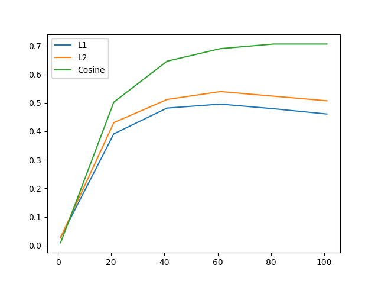
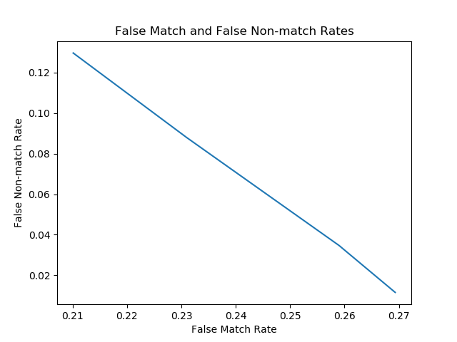

### IrisRecognition.py

The main function reads all the images and translate images into 2,044 feature vectors. It also generates plots for Iris recognition rate by different dimensions in LDA and false match rates against fasle non-match rates for different thresholds.

### IrisLocalization.py

#### def pupil_detection:
Based on data, pixel values lower than 75 represents a pupil area. For some cases, the threshold includes some parts from eyelashes as noise in a binarized image. Therefore, we can easily remove the noise by running the follow code.
```python
kernel = np.ones((15,15), np.uint8)

# MORPH_CLOSE is useful in closing small holes inside the foreground objects, 
# or small black points on the object. (OpenCV 3.0.0-dev documentation)
im_bw = cv2.morphologyEx(im_bw, cv2.MORPH_CLOSE, kernel)
```
We can precisely calculate the origin and the radius of a pupil.
```python
# length: from 0 to 279
length = np.array(range(len(im_bw)))
# width: from 0 to 319
width = np.array(range(len(im_bw[0])))

col = int(round(np.mean(width[np.mean(im_bw, axis=0) != 255])))
row = int(round(np.mean(length[np.mean(im_bw, axis=1) != 255])))

r1 = sum(im_bw[row, :] == 0)
r2 = sum(im_bw[:, col] == 0)
r = int(round((r1+r2)/4))
```
It calculates the center of a pupil by getting pixel coordinates and computing the mean. The radius is the average of the vertical length and the horizontal length from the center. Finally, it returns the center and the radius of a pupil.

#### def outer boundary:
It resizes a image by 30% in order to speed up the computation. After downsizing the image, it applies blurring and the Canny edge detector.
```python
edges = cv2.Canny(resized_image, a, b)
```
It removes the pupil area to remove noise created from eyelashes and the pupil edge. It turns out that removing a circular area centered at the pupil center with the radius of 12 pixels greater than the pupil radius works well for our purposes.
```python
n, m = edges.shape
# r is the radius of a pupil
r1 = r + 12
y1, x1 = np.ogrid[-row:n-row, -col:m-col]
mask = x1*x1 + y1*y1 <= r1*r1
edges[mask] = 0
```
Then it subsequently removes unnecessary edges detected outside of the eye area. 
```python
# trying to locate first edge found below the eye
lower_removal = edges[row+r+8:, col]
l_bound = np.argmax(lower_removal == 255)+row+r+8
# trying to locate first edge found above the eye
upper_removal = edges[row-r-8:, col]
u_bound = row-r-8+np.argmin(upper_removal == 255)

# remove upper and lower parts
edges[:u_bound, ] = 0
edges[l_bound:, ] = 0

# trying to locate first edge found left of the eye
left = edges[row, :col][::-1]
left = np.argmax(left == 255)

# trying to locate first edge found left of the eye
right = edges[row, col:]
right = np.argmax(right == 255)

# we might have no edges found along the center 
if (col-left-2 > 15) and left != 0:
    edges[:, :(col-left-2)] = 0
# if so, remove the area where no eyes have been found in the training data
else:
    edges[:, :20] = 0

# we might have no edges found along the center 
if (x-(col+right+2)) > 15 and right != 0:
    edges[:, (col+right+2):] = 0
# if so, remove the area where no eyes have been found in the training data
else:
    edges[:, 90:] = 0
```

After removing noise, it applies Hough transformation to fit a circle for the outer boundary of a pupil. If circles cannot be found, we manually fit a circle centered at the pupil circle with the average radius of outer bounds of eyes in the dataset.
```python
circles = cv2.HoughCircles(edges, cv2.HOUGH_GRADIENT,1,70,param1=20,param2=3,minRadius=30,maxRadius=35)
    if circles is not None:
        circles = np.uint16(np.around(circles/0.3))
        for i in circles[0,:]:

            return i[0], i[1], i[2]
    else:
        col = int(round(col/0.3))
        row = int(round(row/0.3))
        r = int(round(r/0.3)) + 60
```

### IrisNormalization.py
Dectected circles for the inner boundary and the outer boundary of an iris is usually not concentric. 
It calculates the closest point from the pupil center to the outer boundary.
```python
r = int(round(out_r - np.hypot(in_col-out_col, in_row-out_row)))
```
This step might face two error cases.
1. Outer boundary is wrongly defined.
```pyton
if r < in_r + 15:
    r = 80
```
This happens when the inner circle and the outer circle are too close to each other. Then it manually assigns the radius of a nomalizing area.

2. Outer boundary does not fit in the image.
```python
maxh, maxw = img.shape
r2 = min(in_col, in_row, maxh-in_row, maxw-in_col)
```
It calculates the closest distance from the center to all image boundaries. After checking these errors, we finally define the region that we want to normalize.
```python
    r = min(r, r2)
    max_r = r - in_r
    M = 64
    N = 512
    normalized = []
    for y in range(M):
        row_pix = []
        for x in range(N):
            theta = float(2*np.pi*x/N)
            hypotenuse = float(max_r*y/M) + in_r
            col = int(round((np.cos(theta) * hypotenuse) + in_col))
            row = int(round((np.sin(theta) * hypotenuse) + in_row))
            row_pix.append(img[row,col])
        normalized.append(row_pix)
```
Since IrisLocalization is not perfect, we often find the outer boundary including the area outside the iris. In order to remove that noise, we draw another circle centered at the pupil center with the radius that we computed ealier. Then it normalizes the iris area to a rectangular image of size 64 by 512.

### ImageEnhancement.py
It divides the normalized image into 16 by 16 grids and equalizes the histogram of each grid.
```python
# do not change the original image
img2 = img.copy()
size = 16
for i in range(4):
    for j in range(32):
        # Define each 16 by 16 grid iteratively
        start_height = i*size
        end_height = start_height+size
        start_wid = j*size
        end_wid = start_wid+size
        grid = img2[start_height:end_height, start_wid:end_wid]
        # Histogram Equalization
        img2[start_height:end_height, start_wid:end_wid] = cv2.equalizeHist(grid)
```

### FeatureExtraction.py

#### def spatial_filter:

This function implements the spatial filter defined in the paper.
```python
:param x: x-coordinate
:param y: y-coordinate
:param delta_x: space constants of the Gaussian envelope along the x axis
:param delta_y: space constants of the Gaussian envelope along the y axis
:param f: frequency of the sinusoidal function

modul_fun = np.cos(2*np.pi*f*np.hypot(x, y))
gaus_envelop = (x**2)/(delta_x**2)+(y**2)/(delta_y**2)
spatia_filter = 1/(2*np.pi*delta_x*delta_y)*np.exp(-0.5*gaus_envelop)*modul_fun
```

#### def to_feature_vec:

We are looking at the subset of an image of the size 42 by 511. The paper uses the subset of the size 49 by 512. However, my iris localization includes more eyelid than paper's implementation. So this function uses a smaller region of the original image. Furthermore, it uses 7 by 7 region. So that all the pixels are equally distributed from a given point. Therfore, the dimensions of a selected region are multiples of 7. 
```python
for i in range(len):
    for j in range(wid):
        each_pix1 = 0
        each_pix2 = 0
        for m in range(i-each_side, i+each_side+1):
            for n in range(j-each_side, j+each_side+1):
                # Around the boundaries of the image, it applies the zero-padding.
                if (0 < m < len) and (0 < n < wid):
                    each_pix1 += roi[m, n]*spatial_filter(i-m, j-n, 3, 1.5, 1/1.5)
                    each_pix2 += roi[m, n]*spatial_filter(i-m, j-n, 4.5, 1.5, 1/1.5)
        channel1[i, j] = each_pix1
        channel2[i, j] = each_pix2
```

The final step is to calculate the mean and the average absolute deviation of each 7 by 7 filtered block.
```python
for i in range(int(len/block_size)):
    for j in range(int(wid/block_size)):
            # Define each 7 by 7 filtered block iteratively
            start_height = i*block_size
            end_height = start_height+block_size
            start_wid = j*block_size
            end_wid = start_wid+block_size
            grid1 = channel1[start_height:end_height, start_wid:end_wid]
            grid2 = channel2[start_height:end_height, start_wid:end_wid]

            # Channel 1
            absolute = np.absolute(grid1)
            # mean
            mean = np.mean(absolute)
            feature_vec.append(mean)
            # absolute deviation
            std = np.mean(np.absolute(absolute-mean))
            feature_vec.append(std)

            # Channel 2
            absolute = np.absolute(grid2)
            # mean
            mean = np.mean(absolute)
            feature_vec.append(mean)
            # absolute deviation
            std = np.mean(np.absolute(absolute-mean))
            feature_vec.append(std)
```
As a result, each feature vector has the dimension of 1,752 (6\*73\*4). 


### IrisMatching.py
Fit Sklearn LinearDiscriminantAnalysis on the feature vectors. In order to use the distance metrics provided in the paper, it transforms the feature vector into the appropriate dimension, then predicts the result.

### PerformanceEvaluation.py
Performance is evaluated by three different distance measures and dimensionality reduction in LDA. Three metrics are L<sub>1, L<sub>2 and Cosine Similarity. It checks all the metrics over all possible dimensionality reduction domain.



Recognition Results Using Different Similarity Measures

| Similarity| Dimension 40 | Dimension 60 | Dimension 80 | Dimension 100 |
| :---: | :---: | :---: | :---: | :---: |
| L<sub>1 | 0.48 | 0.50 | 0.48| 0.46 |
| L<sub>2 | 0.51  | 0.54| 0.52 | 0.51 | 
| Cosine | 0.65 | 0.69 |0.71| 0.72 |
    


LDA can calculate the probability of each point being associated with each class. Instead of picking the class with the highest probability, it rejects the matching if the probability is lower than the threshold. Then it calculates False match rate and False non-match rate.

False Match and False Nonmatch Rates with Different Threshold Values

| | False match rate | False non-match rate|
| :---: | :---: | :---: | 
| 0.4 | 0.27 | 0.01  |
| 0.5 | 0.26  | 0.03  |
| 0.7 | 0.23  | 0.09  |
| 0.8 | 0.21  | 0.13  |

The best performing distance metric is Cosine Similarity with the 0.72 recognition rate. I can improve the desing by more accurately capturing iris area. I noticed that there are many iris images that contains significant amount of eyelids. The paper only uses upper 48 pixels, but even doing so cannot remove eyelids for my localization algorithm. I should test with different dimensions of nomalization images, in order to improve the recognition rate.
